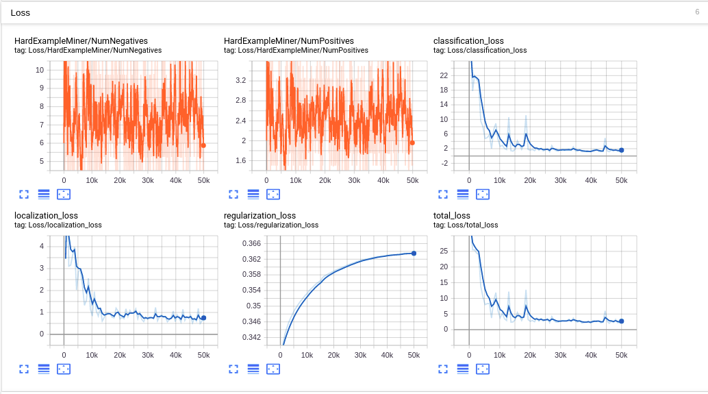
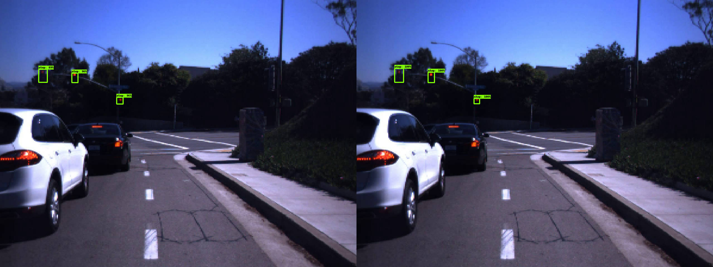

# Traffic-Light-Detector
Transfer learning with Tensorflow Object Detection API and Kaggle LISA dataset


This project demonstrates how to build your own traffic light detector using Tensorflow Object Detection API. Most of the necessary steps will be explained, including preparing input images, generate TFrecords, customize pipeline config files, transfer learning, and test.

For a more detailed video instruction, please refer to this YouTuber's series: [link](https://pythonprogramming.net/introduction-use-tensorflow-object-detection-api-tutorial/).

However, his series was based on some older version of the Tensorflow API. In my document I will be using the lastest version.

Let's get started!

## Install the environment

First, you need to install the [Tensorflow Object Detection API](https://github.com/tensorflow/models/tree/master/research/object_detection) by downloading or cloning. Following the official instructions, the installation can be done fairly easily.

## Find a image dataset

I used the [LISA Traffic Light Dataset](https://www.kaggle.com/mbornoe/lisa-traffic-light-dataset) provided by Kaggle. However, there are other datasets that you can use, such as [Bosch small traffic lights dataset](https://hci.iwr.uni-heidelberg.de/node/6132). Just download whichever you like. Remember, having a pre-labeled dataset will save you tons of time. Otherwise you need to label them by hand. This can also be done but it's out of this project's scope.

To use your own dataset in Tensorflow Object Detection API, you must convert it
into the [TFRecord file format](https://www.tensorflow.org/api_guides/python/python_io#tfrecords_format_details).
You can visit this [document](https://github.com/tensorflow/models/blob/master/research/object_detection/g3doc/using_your_own_dataset.md) to see how to write a script to generate the TFRecord file.


## Dataset Requirements

### Images and Annotations

For every example in your dataset, you should have the following information:

1. An RGB image for the dataset encoded as jpeg or png.
2. A list of bounding boxes for the image. Each bounding box should contain:
    1. A bounding box coordinates (with origin in top left corner) defined by 4
       floating point numbers [ymin, xmin, ymax, xmax]. Note that we store the
       _normalized_ coordinates (x / width, y / height) in the TFRecord dataset.
    2. The class of the object in the bounding box.

I used the LISA dataset which comes with annotations in CSV format.

### Label Maps

Each dataset is required to have a label map associated with it. This label map
defines a mapping from string class names to integer class Ids. The label map
should be a `StringIntLabelMap` text protobuf. Sample label maps can be found in
object_detection/data. Label maps should always start from id 1.

I wrote my own [label map](data/lisa_label_map.pbtxt) for the selected portion of LISA dataset.


## TF Record files preparation

With the LISA dataset images and annotation CSVs, first I need to generate tfrecords for training and testing. Since I'm only using about 300 images selected from LISA, I didn't put them into separate record files or shuffle them. Instead, I split them into `train` and `test` folders, and seleted the annotation CSV corresponding rows. This can be found in [here](data/trainAnnotationsBOX.csv).

Then, with [this script](generate_tfrecord.py), we can generate the tfrecord files for train and test datasets. The tensorflow API has [instructions](https://github.com/tensorflow/models/blob/master/research/object_detection/g3doc/using_your_own_dataset.md) of how to generate tfrecords off your own dataset. I used a opensource script written by [datitran](https://github.com/datitran/raccoon_dataset) to generate tfrecords from my [images](images/) and [annotation CSV files](data/trainAnnotationsBOX.csv). To generate your own tfrecords, you will need to modify some of the PATHs in the bash command that calls this python script:

```
```

The generated tfrecord files can be found [here](data/).

## Pipeline Config File

Now that the TF record files are ready, the label map text is ready, are we ready to train a pre-trained model by transfer learning? Not quite. First, we need to first download a pre-trained model such as SSD-MobileNet-COCO from the [TF Model Zoo](https://github.com/tensorflow/models/blob/master/research/object_detection/g3doc/detection_model_zoo.md). And we need to get a sample pipeline config file like [this one](training/ssd_mobilenet_v1_coco.config), they can be found in [Tensorflow API](https://github.com/tensorflow/models/tree/master/research/object_detection/samples/configs) as well.

After obtaining a config file, I modified it according to my training needs. For example, the `num_classes` should be modified from 90 to 4, which is my class number.
```
model {
  ssd {
    num_classes: 4
    box_coder {
      faster_rcnn_box_coder {
        y_scale: 10.0
        x_scale: 10.0
        height_scale: 5.0
        width_scale: 5.0
      }
    }
```
The last part of the config file should also be modified according to my own TF record files and label map:
```
train_input_reader: {
  tf_record_input_reader {
    input_path: "data/train.record"
  }
  label_map_path: "data/lisa_label_map.pbtxt"
}

eval_config: {
  num_examples: 2000
  # Note: The below line limits the evaluation process to 10 evaluations.
  # Remove the below line to evaluate indefinitely.
  max_evals: 10
}

eval_input_reader: {
  tf_record_input_reader {
    input_path: "data/test.record"
  }
  label_map_path: "data/lisa_label_map.pbtxt"
  shuffle: false
  num_readers: 1
}
```

## Transfer Learning

The learning is done in the installed Tensorflow Object Detection API directory, with [this script](model_main.py) that comes with installation. **Notice: the following bash command shall be run in the terminal to run the script.**

```
python3 model_main.py \
    --pipeline_config_path=${PIPELINE_CONFIG_PATH} \
    --model_dir=${MODEL_DIR} \
    --num_train_steps=${NUM_TRAIN_STEPS} \
    --sample_1_of_n_eval_examples=$SAMPLE_1_OF_N_EVAL_EXAMPLES \
    --alsologtostderr
```

where the variables inside {} must be specified based on your own setting. In my case, they are:

```
PIPELINE_CONFIG_PATH=training/ssd_mobilenet_v1_coco.config
MODEL_DIR=ssd_mobilenet_v1_coco_11_06_2017
NUM_TRAIN_STEPS=50000
SAMPLE_1_OF_N_EVAL_EXAMPLES=1
```

The training took me about 12 hours on a ThinkPad P50, with the training set being about 270 images.

Some of the statistics of the training can be viewed by TensorBoard, such as loss:



and predition vs ground truth:




## Test

After training is done, we need to export the frozen model graph out of the training results. This can be done with [this script](export_inference_graph.py) that comes with the installation.

Then we can proceed to test the model.

The test is also done in the Tensorflow Object Detection API directory, with this [jupyter notebook](test_obj_detection.ipynb). some of the test results look like this:

